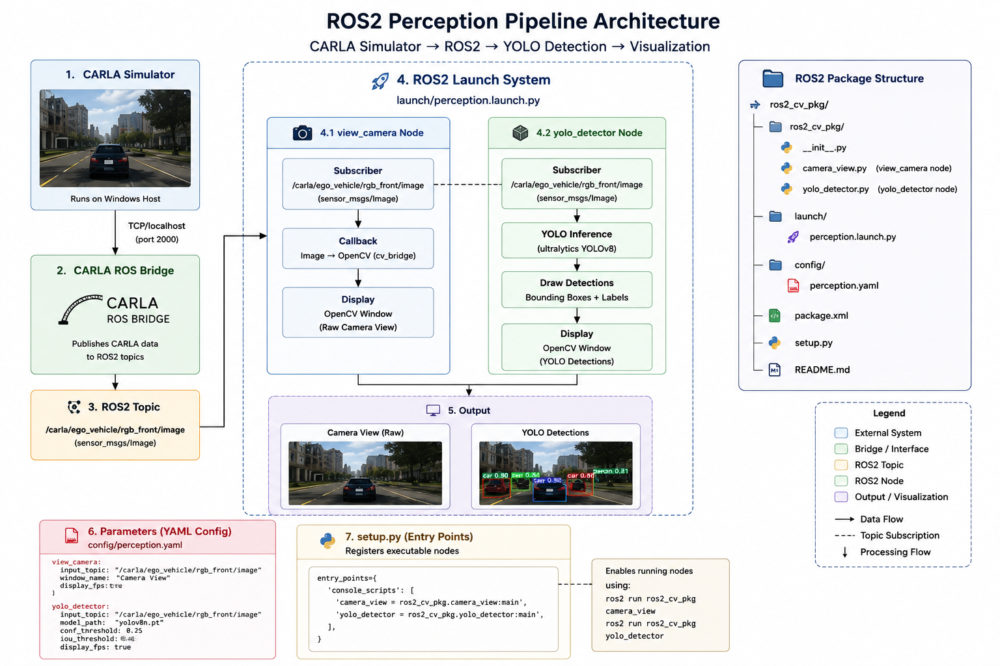

# Phase 3 — Modular ROS2 Architecture

## Objective

Transform the perception pipeline from standalone scripts into a modular ROS2 package architecture that supports maintainability, configurability, and scalable development.

This phase focused on packaging the perception system into a reusable ROS2 application with launch files, centralized configuration management, and multi-node execution.

---

## Architecture

```text
CARLA Simulator
        │
        ▼
RGB Camera Topic
        │
        ▼
ROS2 Launch System
        │
 ┌──────┴──────┐
 ▼             ▼

Camera      YOLOv8
Viewer     Detector

 └──────┬──────┘
        │
        ▼
Visualization
```

---

## System Design

The perception system was restructured into a ROS2 package named:

```text
autonomous_perception
```

The package includes:

- Modular ROS2 nodes
- Launch-based execution
- YAML configuration management
- Parameterized topic configuration
- Package-level dependency management
- Automated startup workflow

---

## Key Components

### ROS2 Package

Core perception package containing the camera visualization and object detection nodes.

**Package**

```text
autonomous_perception/
```

Components:

- `view_camera.py`
- `yolo_detector.py`
- `perception.launch.py`
- `perception.yaml`

---

### Launch System

Launch file responsible for starting multiple perception nodes through a single command.

Benefits:

- Centralized execution
- Simplified deployment
- Consistent runtime configuration

---

### Configuration Management

YAML-based configuration used to manage runtime parameters.

Benefits:

- Centralized settings
- Easier experimentation
- Reduced hard-coded values
- Improved maintainability

---

### Startup Automation

Automation script used to prepare the runtime environment and launch the perception stack.

**File**

```text
scripts/start_perception.sh
```

Responsibilities:

- Activate Python virtual environment
- Source ROS2 workspace
- Patch ROS2 node interpreter paths
- Launch perception system

---

## Validation Results

Successfully validated:

- ROS2 package architecture
- Multi-node launch execution
- YAML-based configuration management
- Parameterized perception nodes
- Camera visualization node
- YOLO detection node
- Automated startup workflow
- End-to-end perception deployment

---

## Deliverables

### ROS2 Package Architecture

<p align="center">
  
</p>

<p align="center">
  Modular ROS2 perception package architecture.
</p>

---

## Engineering Challenges

### ROS2 and Python Virtual Environment Integration

#### Challenge

ROS2 launch files were unable to correctly execute perception nodes that depended on packages installed inside a Python virtual environment.

#### Resolution

- Investigated ROS2 package execution behavior
- Identified Python interpreter resolution issues
- Patched installed ROS2 node entry points to reference the virtual environment interpreter
- Created an automation script to apply the configuration and launch the perception stack

#### Outcome

The perception system could be launched through standard ROS2 workflows while maintaining access to dependencies installed inside the isolated Python environment.

---

## Technologies

- ROS2 Humble
- Python
- OpenCV
- YOLOv8
- Ultralytics
- YAML
- ROS2 Launch System
- CvBridge
- CycloneDDS
- WSL2 Ubuntu 22.04
- Windows 11

---

## Outcome

Phase 3 transformed the project from a collection of perception scripts into a modular ROS2 application. The resulting architecture improved maintainability, deployment consistency, configuration management, and scalability, providing the foundation for profiling, benchmarking, and future autonomous perception development.