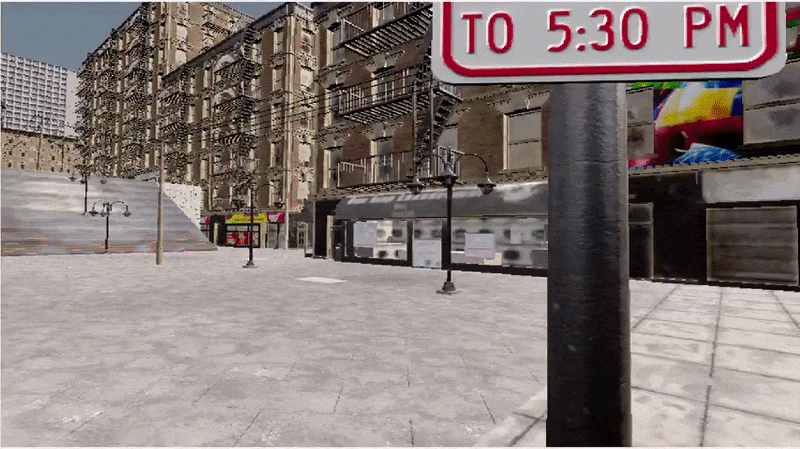
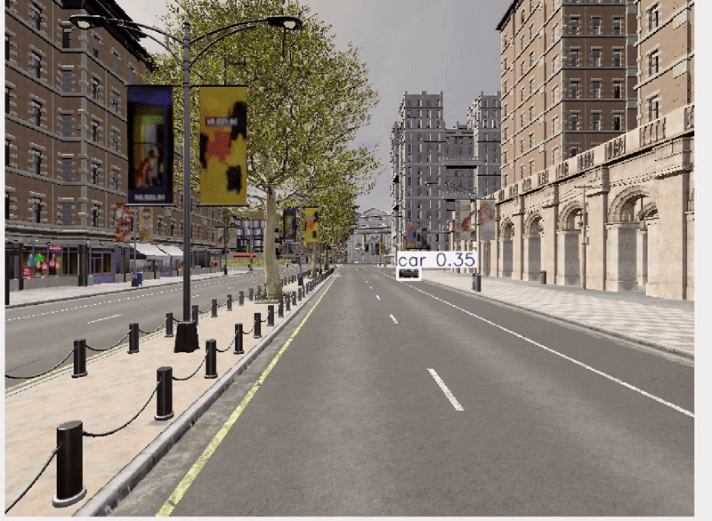

# ROS2 Autonomous Perception Stack — High-Level Plan

## Overview
Build a real-time autonomous perception pipeline using:
- ROS2
- CARLA Simulator
- YOLO-based object detection
- Edge inference optimization
- Semantic segmentation
- Sensor fusion
- ViT-based perception models

---

# Phase 1 — Setup

## Tasks
- Install ROS2 and CARLA
1. Windows 11 CARLA 0.9.15 (installed)
2. WSL2 Ubuntu 22.04 (installed)
3. ROS2 Humble (installed)
4. CARLA ROS Bridge (installed)
5. DDS communication (installed)

- Setup Python/C++ environment (installed)
- Connect CARLA sensors with ROS2 (installed)
- Validate CARLA sensor streaming through ROS2 visualization (Configured)

## Completed
- ✅ Windows ↔ WSL2 networking
- ✅ CARLA ↔ ROS bridge connectivity
- ✅ ROS2 DDS communication
- ✅ WSL2 mirrored networking configuration
- ✅ CARLA bridge stability with 0.9.15
- ✅ ROS topics publishing
- ✅ Ego vehicle, camera, LiDAR, radar, IMU/GNSS integration
- ✅ ROS2 camera subscriber and OpenCV visualization pipeline
- ✅ End-to-end CARLA → ROS2 → OpenCV perception pipeline validation

## Deliverable
- CARLA sensor data published to ROS2 topics
  

  
  

  

  <b>Phase 1:</b> End-to-end CARLA → ROS2 → OpenCV perception pipeline validation with real-time RGB camera streaming on WSL2 Ubuntu 22.04.

---

# Phase 2 — Object Detection

## Tasks
- Enable ego vehicle autopilot (configured)
- Integrate pretrained YOLO model (configured)
- Run real-time detection on CARLA camera stream (configured)
- Visualize detections in ROS2 (configured)

## Completed
- ✅ Ego vehicle autopilot enabled through ROS2
- ✅ Moving scene visualization through OpenCV pipeline
- ✅ Pretrained YOLOv8 integrated with CARLA RGB stream
- ✅ Real-time object detection running through ROS2 pipeline
- ✅ OpenCV visualization with YOLO bounding boxes
- ✅ Dynamic scene perception validated using CARLA autopilot

## Deliverable
- Real-time object detection pipeline

  

  <b>Phase 2:</b> Real-time YOLOv8 object detection on CARLA RGB stream using ROS2, OpenCV, and Python perception pipeline.

---

# Phase 3 — ROS2 Modular Architecture

## Tasks
- Convert standalone scripts into ROS2 package (completed)
- Learn ROS2 package structure (completed)
- Create reusable ROS2 nodes (completed)
- Learn ROS2 launch system
- Learn topic remapping
- Learn ROS2 parameters
- Add config-driven architecture
- Understand ROS2 node lifecycle/debugging

## Completed
✅ Standalone perception scripts converted into modular ROS2 executable nodes
✅ ROS2 workspace, package structure, setup.py, and colcon build system successfully configured

## Deliverable
- Modular ROS2 perception package with launch-based deployment

---

# Phase 4 — Performance Benchmarking

## Comparison
- CPU vs GPU
- FP32 vs FP16
- TensorRT optimized inference

## Metrics
- FPS
- Latency
- GPU/CPU usage

## Deliverable
- Benchmark report and performance comparison

---

# Phase 5 — Edge Inference

## Tasks
- Convert model to ONNX/TensorRT
- Apply quantization (FP16/INT8)
- Run optimized inference on edge device

## Deliverable
- Real-time optimized edge inference pipeline

---

# Phase 6 — Semantic Segmentation

## Tasks
- Add drivable-area/terrain segmentation
- Integrate segmentation into ROS2 pipeline

## Deliverable
- Detection + segmentation perception pipeline

---

# Phase 7 — Sensor Fusion

## Tasks
- Add LiDAR sensor in CARLA
- Fuse RGB camera + LiDAR information
- Estimate object distance and scene understanding

## Deliverable
- Basic camera + LiDAR fusion pipeline

---

# Phase 8 — ViT-Based Detection Extension

## Tasks
- Integrate transformer-based detector

## Comparison
- Accuracy
- FPS
- Latency
- Edge suitability

## Deliverable
- CNN vs ViT perception comparison

---

# Final Deliverables

- GitHub repository
- Demo video
- Benchmark report
- ROS2 modular perception stack
- CNN vs ViT comparison
